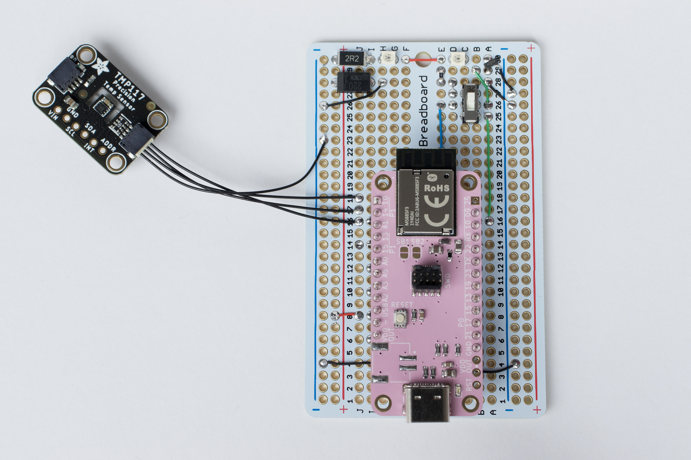

# Air Conditioning Adapter for Home Assistant



## Functional Overview

```
    Ethernet Network
   ──────────────────────────┬──────────────────────────┬─────────────────────────┬────────
                             │                          │                         │
                             │                          │                         │
                             │                          │                         │
                  ┌──────────┴───────────┐              │                         │
                  │                      │              │                         │
                  │ Thread Border Router │              │                         │
                  │                      │              │                         │
                  └──────────┬───────────┘              │                         │
                             │                          │                         │
                             │                          │                         │
                             │                          │                         │
 ┌─────────────┐    ┌────────┴─────────┐       ┌────────┴────────┐       ┌────────┴─────────┐
 │             │ IR │                  │       │                 │       │                  │
 │   AC Unit   ◄────┤   This Project   │ ◄───► │   MQTT Server   │ ◄───► │  Home Assistant  │
 │             │    │                  │       │                 │       │                  │
 └─────────────┘    └──────────────────┘       └─────────────────┘       └──────────────────┘
                    MQTT HVAC integration
```

# Project Management

## Init

```bash
mkdir project-nrf-ac-control
cd project-nrf-ac-control
docker run --rm -it -u $(id -u):$(id -g) -v $(pwd):/workdir/project nordicplayground/nrfconnect-sdk:v2.3-branch bash
west init -m https://github.com/fgervais/project-nrf-ac-control.git .
west update
```

## Build

```bash
cd application
docker compose run --rm nrf west build -b pink_panda -s app
```

## menuconfig

```bash
cd application
docker compose run --rm nrf west build -b pink_panda -s app -t menuconfig
```

## Clean

```bash
cd application
rm -rf build/
```

## Update

```bash
cd application
docker compose run --rm nrf west update
```

## Flash

### nrfjprog
```bash
cd application
docker compose -f docker-compose.yml -f docker-compose.device.yml \
        run nrf west flash
```

### pyocd
```bash
cd application
pyocd flash -e sector -t nrf52840 -f 4000000 build/zephyr/zephyr.hex
```

# Hardware

https://github.com/fgervais/project-nrf-ac-control_hardware
